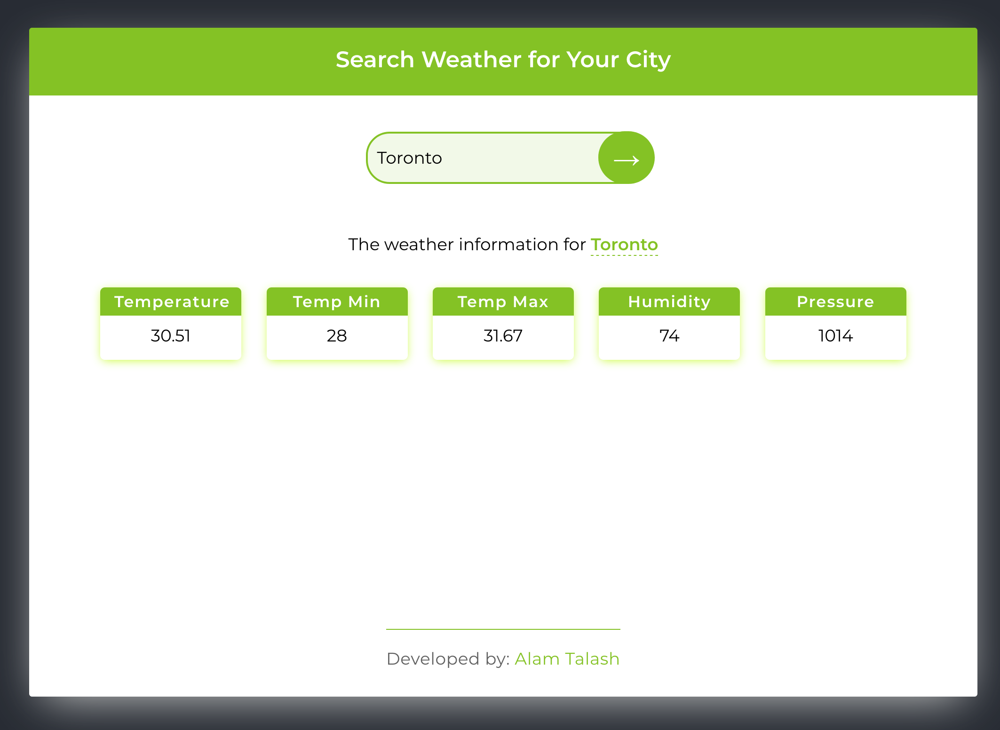

# Weather App

---

### About:

Weather App accepts city and displays current weather for that city.

## Technoloogies used:

- React
- React Hooks
- React Context
- Git

## Software used in this Project:

- Visual Studio Code
- GitHub
- Google Chrome Developer Tools

## How to use it:

- Please download or clone the repository
- create an account in https://openweathermap.org/
- create you API key
- provide your API key in main.js
- run npm install in the main folder

## Developed by:

Alam Talash
https://alamtalash.com

#### Date: July 8, 2020
